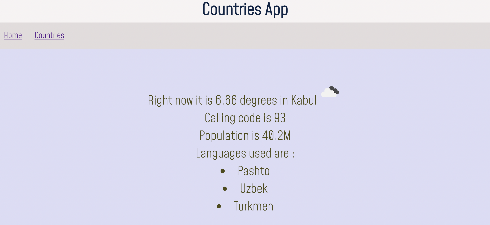

# County weather App

- This is  country weather app created using react. 
- This app is to show details
of countries such as country name, capital, currency, population ,
        weather and country flag.
- I have used axios to fetch data from
        two API's which are restcountries and openweather.
- Using search box you can search using country name to filter the details of a particular country
- By clicking on Country card will display weather,pupulation,calling code and languages of that country.

##

